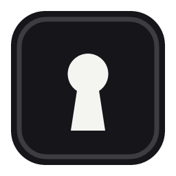
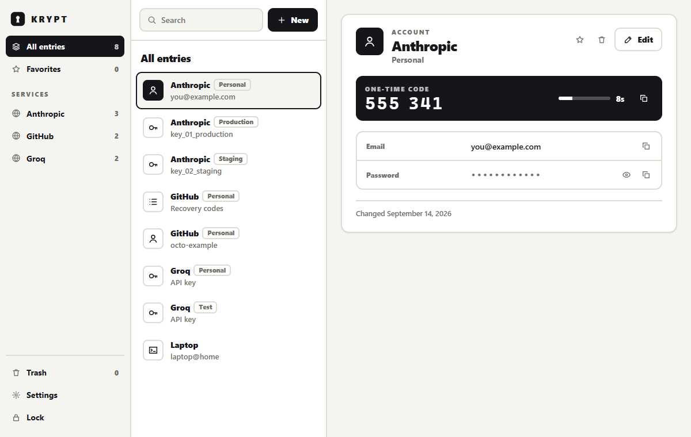
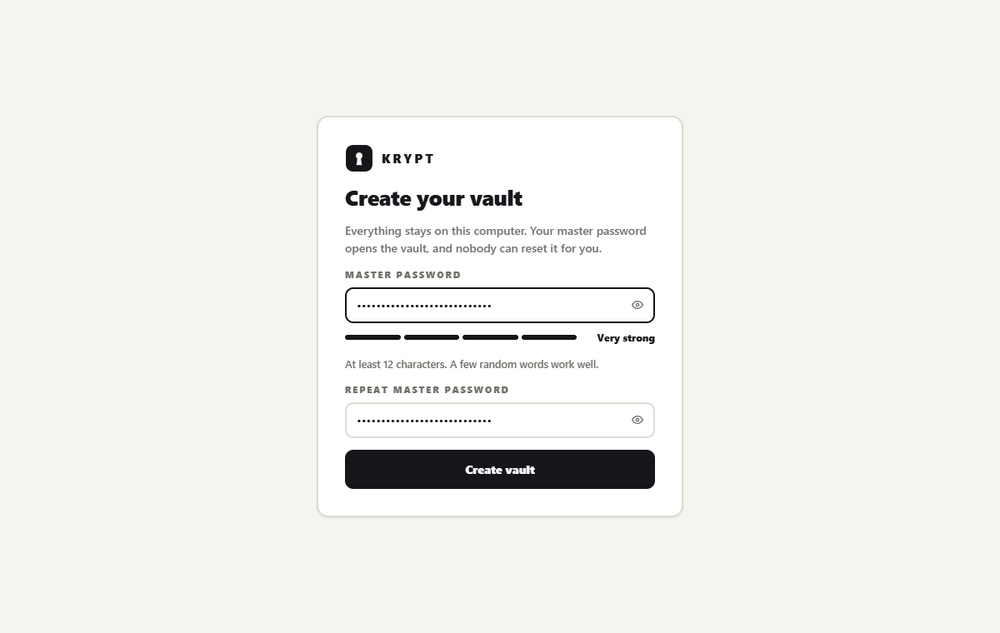
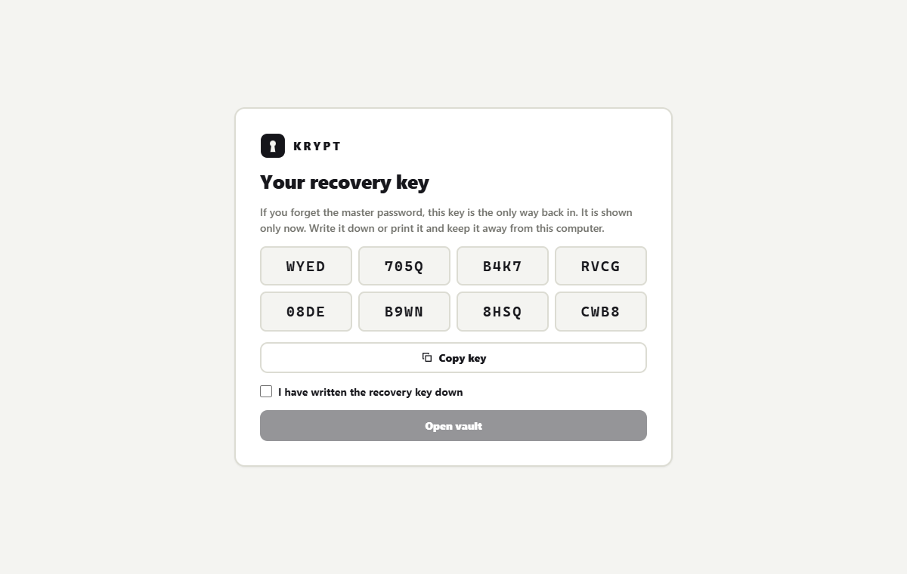
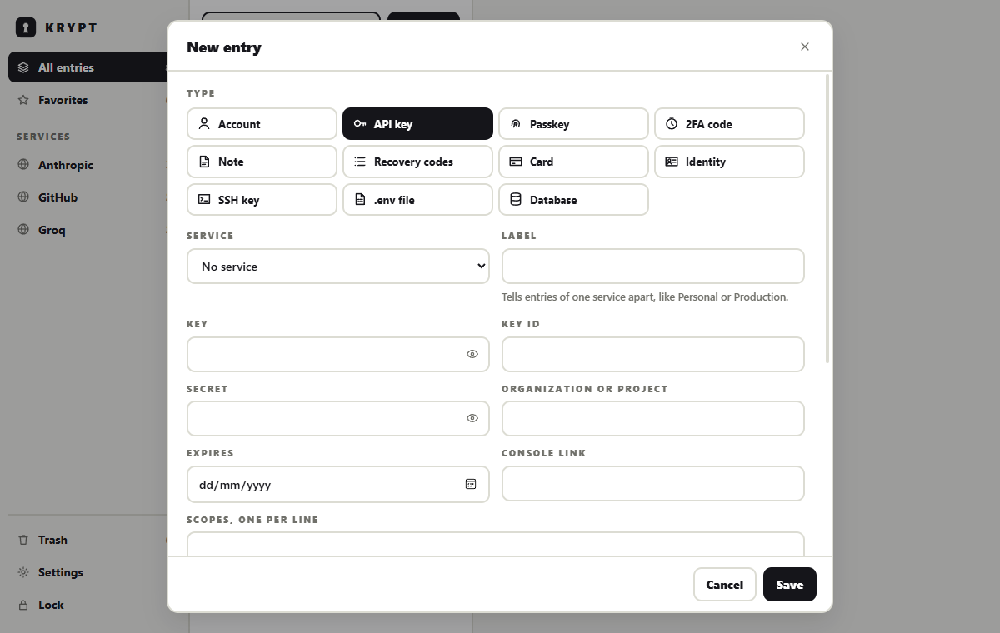
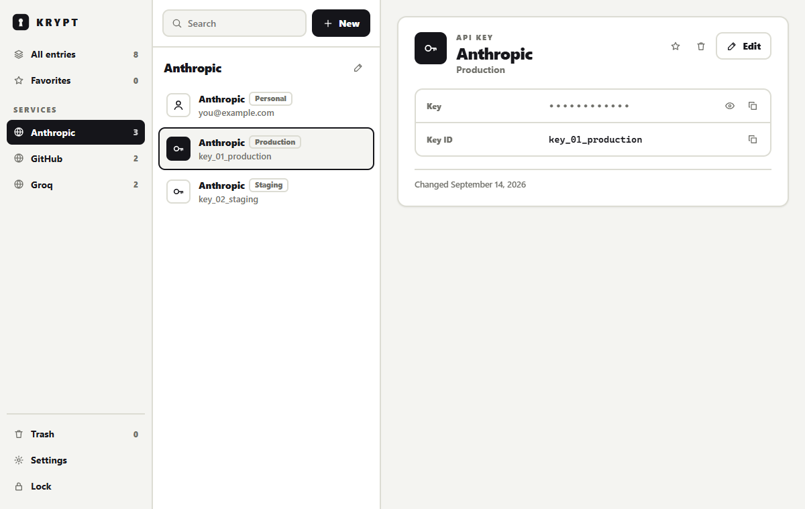
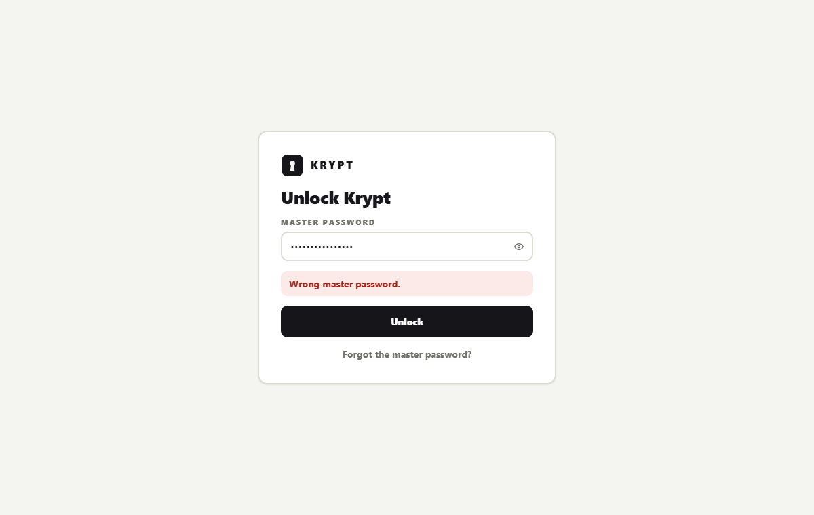
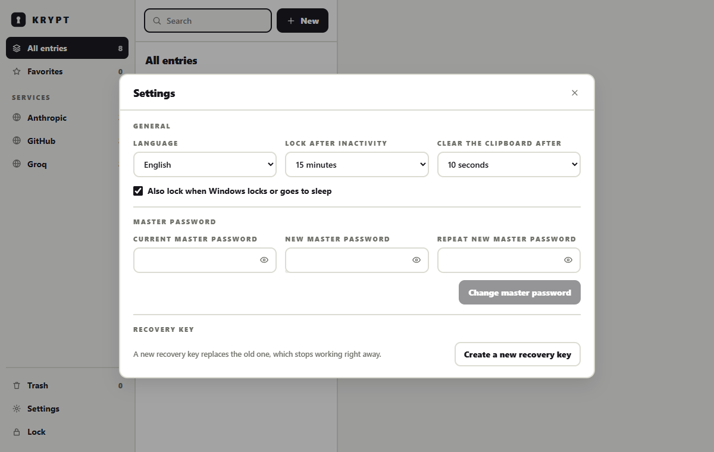

<div align="center">



# Krypt

**Every login, key and code, locked on your own device.**

Krypt is a password manager for Windows. It keeps accounts, API keys, 2FA codes, recovery
codes, cards, SSH keys and the rest in one place, grouped by the service they belong to. A
Chrome extension, an optional account and Android and iOS follow later.

[](#status)
[](#roadmap)
[](LICENSE)



</div>

---

## Why?

A service like Anthropic is not one password. It is an account and two API keys. Groq is just
two keys. Most password managers are built around one login per website, so keys, recovery
codes and tokens end up in a note field where nothing can find or fill them.

Krypt treats the **service** as the unit and lets it hold any mix of entries. The second
decision is where your data lives: everything works on your own machine without an account.
An account will be optional, and the server will only ever store data it cannot read.

## Status

The Windows app runs from source and covers the local vault: setup, unlocking, every entry
type, one-time codes, search, trash and auto-lock. There is no release and no installer yet.
The browser extension, the account and the phone apps are not started.

## Getting started

1. **Build and start the app** as described under [Development](#development). On the first
   start Krypt asks for a master password of at least 12 characters.

   

2. **Write down the recovery key.** It is shown once and is the only way back in if you forget
   the master password. Krypt only continues after you confirm.

   

3. **Add an entry with New.** Pick a type, choose a service or create one on the spot, give it
   a label like Production, and fill in the fields. Paste an `otpauth://` link to add 2FA codes.

   

4. **Open a service in the sidebar** to see everything that belongs to it. Secrets stay hidden
   until you show or copy them.

   

## Features

### Store

- **One service, many entries.** Several accounts per site, an account next to API keys, or
  only keys. A service keeps its domains, so the extension will be able to match them.
- **Eleven entry types.** Account, API key, passkey, 2FA code, secure note, recovery codes,
  card, identity, SSH key, `.env` file and database login, each with custom fields, notes and
  tags.
- **Switch the type while adding.** Fields you already typed come back if you switch back.
- **Password history.** Changing an account password keeps the previous 20, listed under the
  account with the date each one was replaced.
- **Trash.** Deleted entries can be restored until you empty the trash.

### Use

- **Hidden until asked.** The window receives a secret only when you show or copy that one
  field; lists never contain secrets.
- **Copying cleans up.** Copies are marked so Windows leaves them out of the clipboard history
  and the cloud clipboard, and are removed after 30 seconds unless you copied something else.
- **One-time codes** with a countdown, for accounts and as their own entries.
- **Search** across services, labels, usernames, types and tags.

### Stay in control

- **Local first.** No account, no connection, one encrypted file on your machine.
- **Auto-lock** after a chosen idle time, from one minute to never, and when Windows locks or
  goes to sleep unless you turn that off.
- **Backups** of the vault on the first unlock after every start: the newest ten, plus one per
  week for the last eight weeks.
- **Nothing lost by accident.** Closing an entry with unsaved changes asks first.
- **English and German**, following Windows until you pick one.

## Screens

| | |
|---|---|
| **Unlock.** A wrong password is refused. | **Settings.** Language, auto-lock, clipboard, master password, recovery key. |
|  |  |

## Keyboard

| Keys | Action |
|---|---|
| `Ctrl+F` | Search |
| `Ctrl+N` | New entry |
| `Ctrl+L` | Lock |
| `Esc` | Close a dialog; asks first if an entry has unsaved changes |

## One service, many entries

```
Anthropic            anthropic.com, console.anthropic.com
├─ Account           you@example.com, password, 2FA
├─ API key           "Production"
└─ API key           "Staging"

Groq                 console.groq.com
├─ API key           "Personal"
└─ API key           "Test"
```

## Security design

The design was written down before any crypto code existed. It has not had an external review
yet; that is planned before the first release.

| Part | Choice |
|---|---|
| Master password to key | Argon2id, 64 MiB, 3 passes, 4 lanes; stored per vault and raised on the next unlock when Krypt's defaults go up. The password is normalized to Unicode NFC first |
| Encryption | XChaCha20-Poly1305, every service and every entry on its own |
| Tamper detection | each ciphertext is bound to its id, so swapping two records makes both fail to decrypt |
| Key hierarchy | one random vault key, stored once per way in: master password, recovery key, later a remembered device or a passkey |
| Recovery key | 160 random bits, shown once, written as eight groups of four characters |
| Desktop app | keys stay in Rust; the web view gets masked entries and single fields on request, under a strict content security policy |
| Account login | the server never receives anything that can decrypt the vault |

If you lose the master password and the recovery key, the vault cannot be opened. That is the
cost of nobody else being able to open it.

The implementation is checked against published test vectors: Argon2id from the reference
implementation, HKDF from RFC 5869, XChaCha20-Poly1305 from the IETF draft and TOTP from
RFC 6238.

## How data is stored

```
%APPDATA%\dev.imkirit.krypt\
├─ vault.db         one SQLite file, every service and entry encrypted on its own
├─ backups\         copies of vault.db, encrypted the same way
└─ settings.json    language, auto-lock and clipboard timer, nothing secret
```

Names, domains, entry types and every field are encrypted. What stays readable is how many
entries exist and when they changed.

## Roadmap

| Phase | Scope | Status |
|---|---|---|
| 0 | Crypto core, data model, storage format, tests | Done |
| 1 | Windows app: local vault, every entry type, auto-lock, remembered device, installer | In progress |
| 2 | Chrome extension: save prompt, fill, 2FA, passkeys | Planned |
| 3 | Optional account: passkey sign-in, encrypted cloud backup | Planned |
| 4 | Android and iOS, sync between devices | Planned |

## Development

Needs a stable Rust toolchain, Node 24 and the WebView2 runtime that ships with Windows 11.

```bash
cargo test --workspace                                   # core, storage and app backend
cargo clippy --workspace --all-targets -- -D warnings    # lints, must pass without warnings
cargo deny check                                         # licenses, sources, advisories
cargo audit                                              # RustSec advisory database
cargo run --release -p krypt-core --example kdf_timing   # how long one unlock takes here
```

The app lives in `apps/desktop`:

```bash
npm install                                    # from the repository root
npm run tauri dev                              # run with hot reload
npm run tauri build -- --debug --no-bundle     # debug build with the interface embedded
node scripts/drive.mjs <path to krypt.exe>     # drive the debug build and take screenshots
```

`crates/krypt-core` holds the cryptography, key slots, the data model and TOTP, with no file
system, network or UI code, so the same crate can later run on phones and as WebAssembly in the
extension. `crates/krypt-store` keeps the vault in SQLite with migrations that copy the file
first. `apps/desktop` is Tauri 2 with a Rust backend and a React interface; the backend logic
sits in `src-tauri/src/backend.rs` without Tauri types so it can be tested directly.

## License

[MIT](LICENSE) © ImKirit
